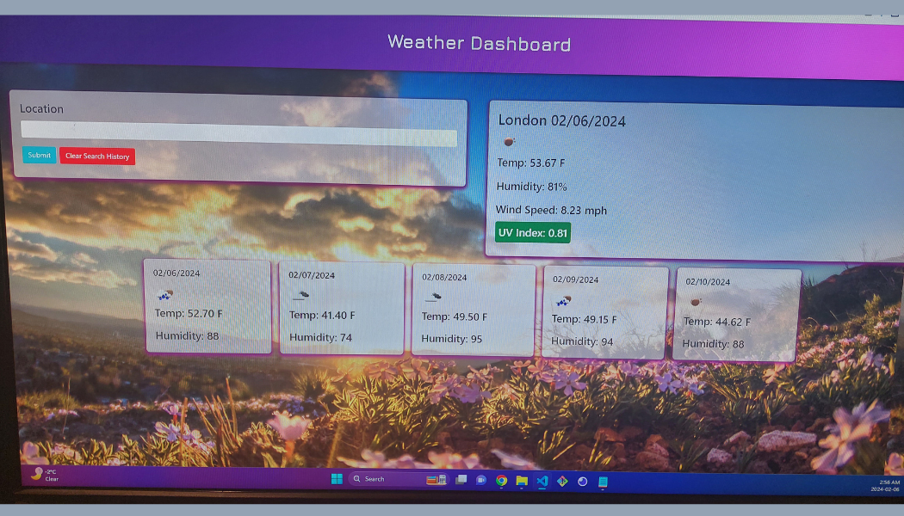

# Weather Dasboard App

## Description
A weather app built using ajax requests. Upon searching a city, the current results are displayed along with a future five day forecast. Current day results feature Location Name, Date, Weather Icon (rainy, sunny, etc), Humidity, Temperature, Wind Speed, and UV Index. Based on UV Index, color styling will change from Red (8+), Orange (6-7), Yellow (3 to 5), and Green (0-2).
Search results will be stored to localStorage. On page load, the most recent historical search data will be populated.

## GitHub Repo Link:
https://github.com/TammyH7/Weather-App

##GitHub Pages Deployed Link:
https://tammyh7.github.io/Weather-App/

## Programs Used
- HTML
- CSS
- JavaScript
- Open Weather API 

## Installation
The html, css, and script files are all in the same folder. If they're kept in the same folder after cloning, the application will run. 

API Key will need to be obtained from [Open Weather](https://openweathermap.org/api) by creating your own account. After account creation, an API key will be availble to you and will be ready to use approx. 2 hours prior to verification and activation of account. 

## Screenshots

 
 
## License

MIT License

## Copyright
Copyright  &copy; 2024 All rights reserved.
